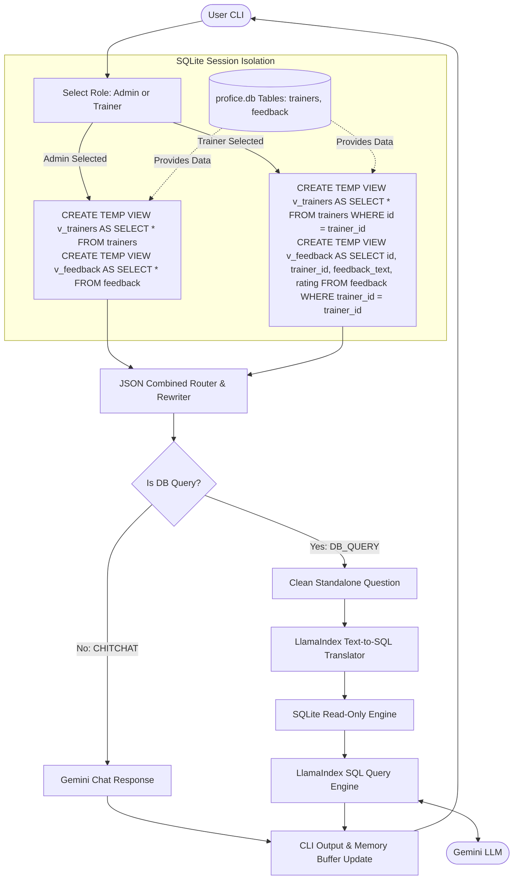

# SQL RAG Chatbot

An intelligent, secure, and highly optimized SQLite database chatbot built with **LlamaIndex** and **Google Gemini** (`gemini-3.1-flash-lite`). It allows users to ask natural language questions in the terminal, resolves conversational contexts, routes chitchat away, enforces role-based access scopes, translates database queries into SQL, and returns responses.

## Architecture

Our secure, single-pass pipeline processes user inputs as follows:



---

## Key Features

1. **Role-Based Access Control (RBAC)**:
   - Enforces user access limits directly at CLI startup.
   - **Admin**: Full database access. Can query all fields, including student evaluation feedback names.
   - **Trainer**: Restricted self-access. Dynamic temp views filter records by the trainer's authenticated ID, and completely exclude the `student_name` column from the feedback schema. This prevents trainers from accessing other trainers' data or viewing student names under any circumstances.
2. **Combined Router & Rewriter (Single-Pass Call)**:
   - Merges intent classification (`DB_QUERY` vs `CHITCHAT`) and conversational memory query-rewriting into a **single Gemini API request** that outputs structured JSON. This cuts down sequential network delay, speeds up responses, and saves 25% of your API quota.
3. **Context-Isolated Conversational Memory**:
   - Maintains a rolling 3-turn memory window in RAM.
   - Intelligently rewrites questions containing pronouns (like *"his rating?"* $\rightarrow$ *"What is Akash K's rating?"*) and isolates contexts (e.g. preventing attribute leakage when asking for *"another"* entity).
4. **Fuzzy Match & Typo Tolerance**:
   - Updates text-to-sql generation prompts to automatically replace exact equality checks (`=`) with `LIKE` wildcards for partial match queries and auto-correct misspelled database entities (e.g. `aksh` $\rightarrow$ `Akash`).
5. **Read-Only Database Enforcement (Safety)**:
   - Connects to SQLite in read-only mode (`mode=ro&uri=true`) to block mutating operations (such as `DROP`, `DELETE`, or `INSERT`) at the database driver level.
6. **Rate-Limit Resilience (Auto-Retries)**:
   - Implements a network retry wrapper that intercepts `429 ResourceExhausted` rate limit exceptions on free-tier keys, sleeping briefly and retrying automatically instead of crashing.

---

## Database Schema

The database `profice.db` contains two tables:

1. **`trainers`**:
   - `id` (INTEGER, Primary Key)
   - `name` (TEXT)
   - `department` (TEXT)

2. **`feedback`**:
   - `id` (INTEGER, Primary Key)
   - `trainer_id` (INTEGER, Foreign Key referencing `trainers.id`)
   - `student_name` (TEXT)
   - `feedback_text` (TEXT)
   - `rating` (INTEGER)

---

## Setup & Running

### 1. Clone the repository
```bash
git clone https://github.com/Shy4n7/SQL-RAG.git
cd SQL-RAG
```

### 2. Install Dependencies
```bash
pip install -r requirements.txt
```

### 3. Initialize the Database
Run the schema creation script to generate `profice.db` and insert seed records:
```bash
python create_db.py
```

### 4. Configure Gemini API Key
Create a `.env` file in the root directory:
```env
GEMINI_API_KEY=your_gemini_api_key_here
```

### 5. Start the Chatbot
Start the interactive terminal CLI session:
```bash
python sql_chatbot.py
```
Upon startup, the CLI will prompt you to select your access role (**Admin** or **Trainer**) before launching the chat loop.

Type `exit` or `quit` to stop the loop.
