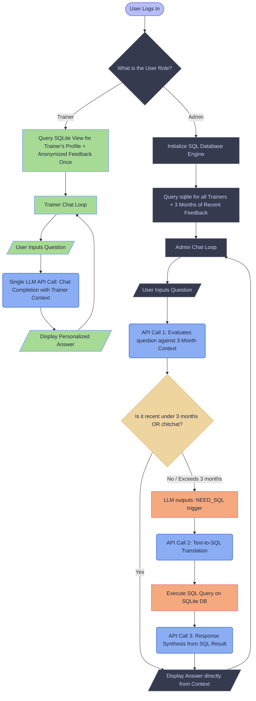
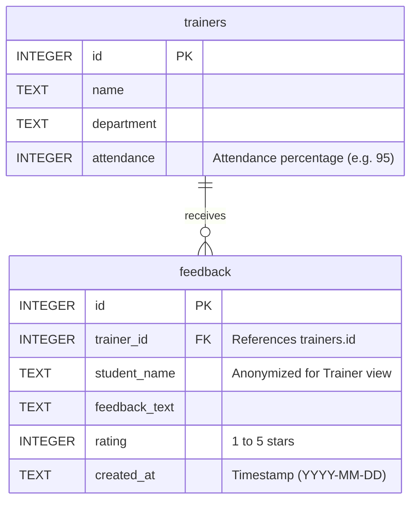

# SQL RAG Chatbot

An intelligent, secure, and highly optimized SQLite database chatbot built with **LlamaIndex** and **Google Gemini** (`gemini-3.1-flash-lite`) utilizing Google's latest unified **Google GenAI SDK**. It features a hybrid role-based flow that separates Admin and Trainer experiences for speed, security, and accuracy.

---

## Architecture

Our secure hybrid pipeline processes user inputs differently based on the authenticated role:



---

## Key Features

1. **Role-Based Access Control (RBAC)**:
   - Enforces user access limits directly at CLI startup.
   - **Admin**: Full database access. Can query all fields, including student evaluation feedback names.
   - **Trainer**: Restricted self-access. Dynamic temp views filter records by the trainer's authenticated ID, and completely exclude the `student_name` column from the feedback schema. This prevents trainers from accessing other trainers' data or viewing student names under any circumstances.
2. **Admin Smart Fallback (1-2 API Calls)**:
   - At startup, the chatbot loads **3 months of recent feedback** and all trainer profile data directly into the LLM system context.
   - If the user asks a question about the last 3 months, profile info, or general conversational questions, the LLM answers directly in **1 API Call** (fast response, low latency).
   - If the question requires historical data beyond 3 months, the LLM outputs a `NEED_SQL:` trigger, prompting the python backend to run the LlamaIndex Text-to-SQL engine over the SQLite database.
3. **Trainer Context-Based LLM (1 API Call)**:
   - Bypasses Text-to-SQL query compilation to ensure 100% accuracy and custom styling.
   - Loads the trainer's profile, attendance, and feedback once at startup and places it in-context.
   - Generates friendly, highly personalized responses (addresses the user as "you" or by their name) in **1 API Call**.
4. **Tone & Style Constraints**:
   - Instructs the LLM to write brief, direct, and factual responses.
   - Eliminates excessive flowery praise or long-winded moral support statements, resulting in a cleaner output that saves up to 40% of generation token usage.
5. **Read-Only Database Enforcement (Safety)**:
   - Connects to SQLite in read-only mode (`mode=ro&uri=true`) to block mutating operations (such as `DROP`, `DELETE`, or `INSERT`) at the database driver level.
6. **Rate-Limit Resilience (Auto-Retries)**:
   - Implements a network retry wrapper that intercepts `429 ResourceExhausted` rate limit exceptions on free-tier keys, sleeping briefly and retrying automatically instead of crashing.

---

## Database Schema

The database `profice.db` contains two tables:



---

## Setup & Running

### 1. Clone the repository
```bash
git clone https://github.com/Shy4n7/SQL-RAG.git
cd SQL-RAG
```

### 2. Install Dependencies
```bash
pip install -r requirements.txt
```

### 3. Initialize the Database
Run the schema creation script to generate `profice.db` and insert seed records:
```bash
python create_db.py
```

### 4. Configure Gemini API Key
Create a `.env` file in the root directory:
```env
GEMINI_API_KEY=your_gemini_api_key_here
```

### 5. Start the Chatbot
Start the interactive terminal CLI session:
```bash
python sql_chatbot.py
```
Upon startup, the CLI will prompt you to select your access role (**Admin** or **Trainer**) before launching the chat loop.

Type `exit` or `quit` to stop the loop.

---

## The Journey & Challenges Faced

Building this chatbot was an iterative process of solving progressive challenges, starting from basic API connectivity to advanced performance optimization and database security:

### Phase 1: The Initial Setup & API Transition
* **The Deprecation Trap**: 
  * *Challenge*: The project initially relied on the legacy `llama-index-llms-gemini` library, which led to import errors and deprecation conflicts during environment setup.
  * *Lesson learned*: Migrated the codebase to the modern, unified `llama-index-llms-google-genai` package and integrated the official Google GenAI SDK.
* **Database Safety**:
  * *Challenge*: Standard LLM database connections can allow malicious users to write prompts that modify the database (e.g., SQL injections like *"delete the feedback table"*).
  * *Lesson learned*: Configured the SQLAlchemy engine connection parameters to strictly enforce a Read-Only mode (`mode=ro&uri=true`) at the SQLite driver level, blocking any mutating operations.

### Phase 2: Resolving Conversational Context & Memory
* **Pronoun Resolution (Memory Loss)**:
  * *Challenge*: If a user asked *"Who got the best rating?"* followed by *"what about the others?"* or *"what is his attendance?"*, the Text-to-SQL engine failed because it had no memory of previous questions.
  * *Lesson learned*: Implemented a rolling context memory buffer and taught the LLM to rewrite consecutive prompts into standalone, self-contained questions before sending them to the database.
* **Fuzzy Matches & Typo Tolerance**:
  * *Challenge*: If a user asked about `aksh` or `Akash`, standard SQL translation wrote strict equality filters (`WHERE name = 'aksh'`), returning empty results due to exact name mismatches.
  * *Lesson learned*: Custom-tailored the LlamaIndex Text-to-SQL prompt templates to guide the LLM to use `LIKE` wildcards and partial matches. We also added fuzzy text matching during CLI authentication to handle trainer name typos gracefully.

### Phase 3: Securing the Data (RBAC)
* **Context Leakage between Roles**:
  * *Challenge*: Restricting access scopes so trainers could not query other trainers' metrics or see student names (to preserve evaluation anonymity), while allowing admins full access.
  * *Lesson learned*: Avoided complex application-level filters. Instead, implemented runtime SQLite isolation using temporary views (`CREATE TEMP VIEW v_trainers` / `v_feedback`) dynamically generated at session startup depending on the authenticated role.

### Phase 4: Performance & Cost Optimization
* **The Latency Problem (3 API Calls per Message)**:
  * *Challenge*: Every user input took 4+ seconds because it triggered multiple sequential API calls (Classification $\rightarrow$ SQL Translation $\rightarrow$ Response Synthesis). This was slow and expensive.
  * *Solution*: Implemented a **Smart Fallback Architecture** for the Admin and **Direct Context LLM** for Trainers. By fetching and loading a 3-month snapshot of recent data into the prompt context at startup, chitchat and recent queries are solved instantly in **1 API call** (latency <1.5s). Only historical queries fall back to SQL translation.
* **LLM Verbosity and Token Waste**:
  * *Challenge*: The model default behavior was too wordy, outputting excessive fluff and conversational filler (e.g., *"every great educator uses those insights to refine their craft..."*), inflating token costs.
  * *Solution*: Wrote strict custom prompt guidelines to restrict output formatting, ensuring the chatbot stays concise, direct, and focused solely on factual database results.
