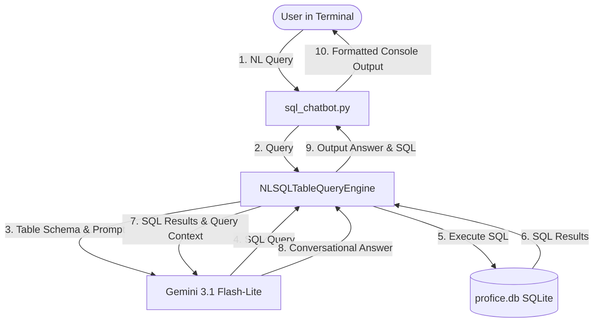

# SQL RAG Chatbot

An intelligent SQLite database chatbot built with **LlamaIndex** and **Google Gemini** that allows users to ask natural language questions in the terminal, automatically converts those questions to SQL, queries the database, and returns conversational answers along with the executed SQL query.

## Architecture



## Database Schema

The database `profice.db` contains two tables:

1. **`trainers`**:
   - `id` (INTEGER, Primary Key)
   - `name` (TEXT)
   - `department` (TEXT)

2. **`feedback`**:
   - `id` (INTEGER, Primary Key)
   - `trainer_id` (INTEGER, Foreign Key referencing `trainers.id`)
   - `student_name` (TEXT)
   - `feedback_text` (TEXT)
   - `rating` (INTEGER)

## Prerequisites

Ensure you have Python 3.8+ installed.

## Setup

1. **Clone the repository**:
   ```bash
   git clone https://github.com/Shy4n7/SQL-RAG.git
   cd SQL-RAG
   ```

2. **Install Dependencies**:
   ```bash
   pip install -r requirements.txt
   ```

3. **Initialize the Database**:
   Run the database creation script to generate `profice.db` and insert initial values:
   ```bash
   python create_db.py
   ```

4. **Add your Gemini API Key**:
   Create a `.env` file in the root directory and add your Google Gemini API key:
   ```env
   GEMINI_API_KEY=your_gemini_api_key_here
   ```

## Usage

Start the interactive terminal session:
```bash
python sql_chatbot.py
```

### Example

```
Ask a question about the database:
> Who is working worse

==================================================
Generated SQL Query:
SELECT T.name, AVG(F.rating) as avg_rating FROM trainers AS T JOIN feedback AS F ON T.id = F.trainer_id GROUP BY T.id ORDER BY avg_rating ASC LIMIT 1
--------------------------------------------------
Answer:
Based on the feedback ratings, Akash L is currently performing the worst, with an average rating of 2.0.
==================================================
```
